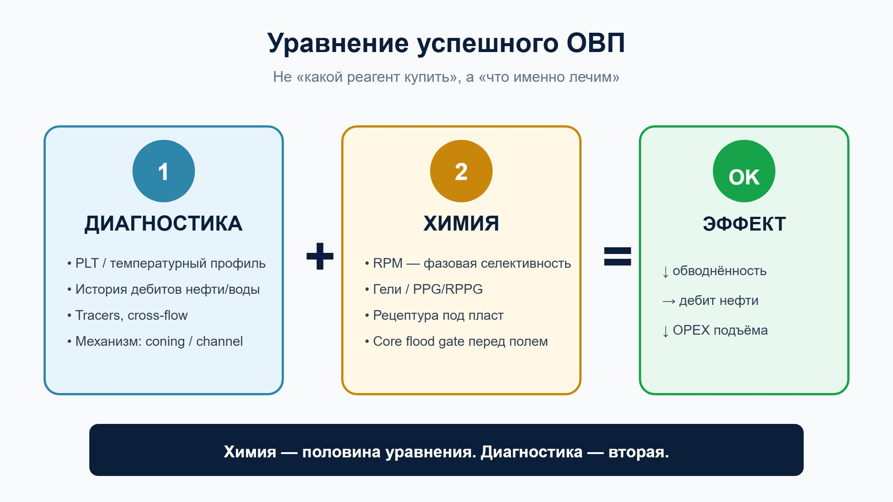
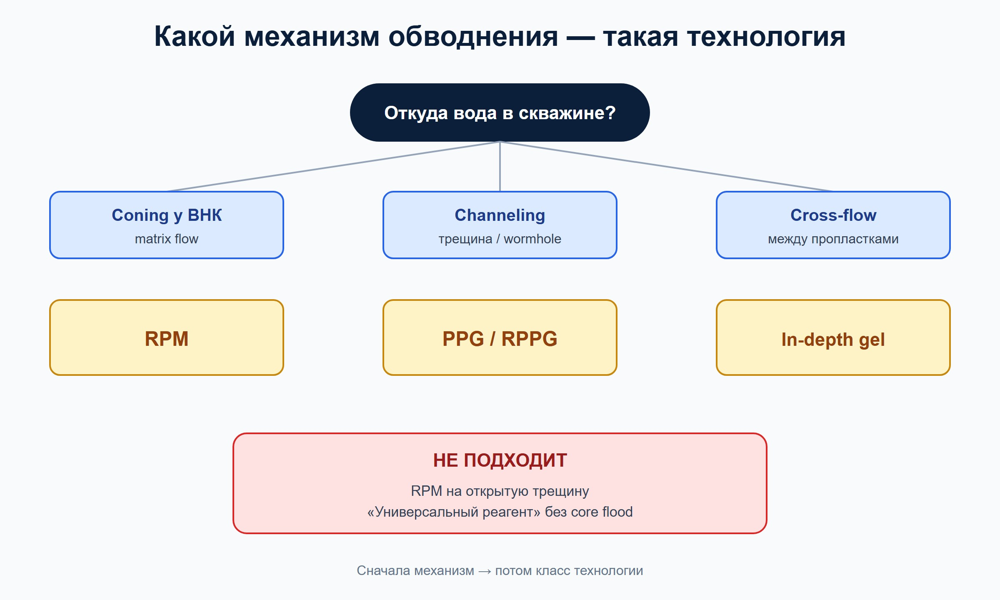
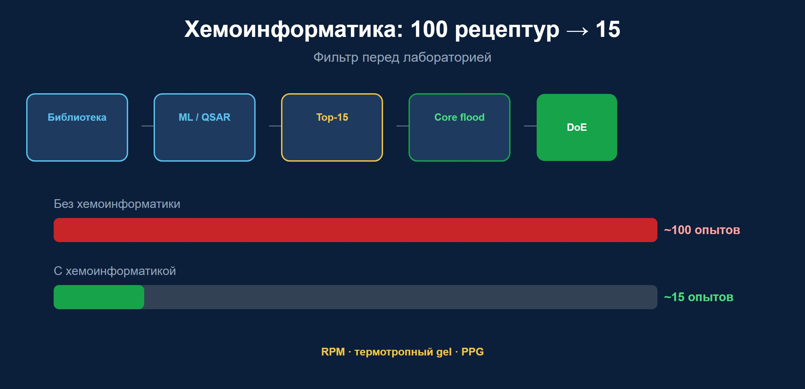
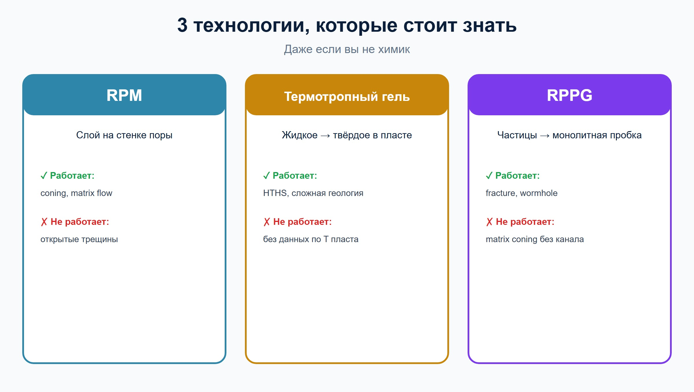
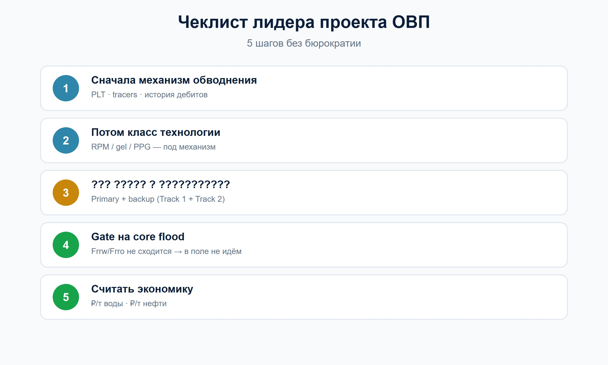

# Селективное ограничение водопритока: сначала диагностика, потом реагент

**Статья для LinkedIn · нефтедобыча · селективное ОВП**

---

Скважина выходит на режим. Дебит растёт. Вроде бы победа.

Через полгода обводнённость — 85%. Нефти стало меньше. Воды — больше. Подъём, подготовка, закачка, износ. OPEX ползёт вверх, а добыча — вниз. Знакомо?

На этом месте обычно начинается одна и та же история: «Нужен реагент. Какой у Halliburton? Сколько стоит? Когда привезут?»

Я недавно разбирал рынок селективных технологий ограничения водопритока — от RPM и термотропных гелей до частиц PPG и классических ВУС на Западной Сибири. И вот что оказалось неожиданным.

**Главная проблема — не в реагенте.**

---

## 3000 скважин и один повторяющийся урок

У одного из самых изученных RPM-систем в мире — **более 3000 промысловых обработок**. Технология работает. Полимер адсорбируется на поровой поверхности, «дует» слой на воде и почти не мешает нефти. Красиво. Элегантно. Bullhead — закачал и забыл.

И всё равно в industry papers снова и снова одна мысль: **success rate держится на candidate selection**.

Не на формуле. Не на цене реагента. На том, **поняли ли вы, откуда в скважине взялась вода**.

Подъём воды у ВНК? Прорыв закачки по трещине? Кросс-flow между пропластками? Техногенный канал за обсадкой?

Для каждого механизма — свой инструмент. RPM бессилен против wormhole шириной в сантиметр. Гель в трещине убьёт и нефть, если не изолировать зону. Жидкое стекло решит проблему быстро — и создаст новую.

**Химия — это половина уравнения. Диагностика — вторая.**

---

## Почему «купить готовое» перестало быть очевидным выбором

Пять лет назад ответ «берём проверенный продукт сервисной компании» звучал разумно. Сегодня — не всегда.

Три причины, которые я вижу в проектах прямо сейчас:

**1. Пласт не читает datasheet.**  
165°C, 160 г/л солей, Ca²⁺, карбонат, oil-wet — универсального реагента не существует. Адаптация рецептуры под конкретный коллектор — это уже R&D, даже если вы покупаете «готовое».

**2. Селективность — маркeting-слово, пока не измеришь.**  
Одни системы режут проницаемость по воде в 5–10 раз, по нефти — в 1,5. Другие просто заливают канал бетоном в миниатюре. На презентации оба называются «water control».

**3. Собственная технология — это не роскошь, а страховка.**  
Когда импортный реагент, сервис и IP уезжают за перimeter, на месторождении остаются только ваши пластовые условия и ваши скважины. Локальная рецептура + понимание механизма = актив, который не конфiscate санкции.

Отсюда растёт интерес к модели: **внутренняя команда + внешний эксперт + хемоинформатика**, вместо «один контракт с подрядчиком и молитва».

---

## Хемоинформатика в нефтпромысловой химии — уже не sci-fi

Представьте: вместо 100 переборов рецептур в лаборатории — 15.

Monomers → descriptors → ML-модель → core flood → DoE.

Не замена эксперимента. **Фильтр перед экспериментом.**

Для RPM это означает подбор соотношения AM/AMPS/гидрофобного comonomer под вашу минералогию и минeralizацию. Для термотропных гелей — предсказание порога гелеобразования при пластовой температуре. Для PPG — связь crosslink density и прочности частицы.

Публикации 2025–2026 года по HTHS-гелям с nano-SiO₂ показывают блокировку воды >95% при сохранении газопроницаемости — но только при рецептуре, заточенной под конкретный ад. Generic не работает.

**Хемоинформатика — это способ не утонуть в переборе.**

---

## Три технологии, которые стоит знать (даже если вы не химик)

### RPM — «умный слой на стенке поры»

Relative Permeability Modifier. Тонкая полимерная плёнка, которая реагирует на capillary forces. Вода — высокие, слой раздувается. Нефть — низкие, слой сжимается. Фазовая селективность в чистом виде.

**Когда работает:** coning, matrix flow, песчаник, умеренная проницаемость.  
**Когда нет:** открытые трещины, гравитационный прорыв по каналу.

### Термотропные гели — «жидкое при закачке, твёрдое в пласте»

Российская школа (ИХН СО РАН, композиции типа МЕГА): маловязкий раствор на поверхности, в пласте — наноструктура «гель в геле». Температура как триггер.

**Когда работает:** высокие T, сложная минералогия, нужна адаптация под месторождение.  
**Когда нет:** если не понятна термика пласта и состав воды.

### RPPG — «частицы, которые пересшиваются в пробку»

Preformed particle gels нового поколения: закачиваются как частицы, в канале пересшиваются в монолитный gel. 15 000+ скважин у классического PPG в мире — и всё равно RPPG появился, потому что обычные частицы **вымывались** из крупных трещин.

**Когда работает:** fracture, wormhole, высокопроницаемые водные streaks.  
**Когда нет:** matrix coning без канала.

---

## Что бы я сделал на месте лидера проекта

Короткий чеклист — без бюрократии:

1. **Сначала механизм обводнения** — PLT, история дебитов, tracers, температурный профиль. Не реагент.
2. **Потом класс технологии** — RPM / gel / PPG. Не наоборот.
3. **Параллельно — два трека в лаборатории** (Track 1 + Track 2), не один. Primary + backup. Четыре месяца — мало для ставки на единственную лошадь.
4. **Gate на core flood** — если Frrw/Frrо не сходится, в поле не идём. Экономим миллионы.
5. **Считать не «стоимость реагента», а ₽ за тонну недобытый воды и ₽ за тонну сохранённой нефти.**

---

## Итог: обводнение снижается, когда понятен механизм

Обводнение — не приговор скважине. Это симптом того, что **фильтрационные потоки изменились**: закачка, геология, время, техногенные каналы.

Селективное ограничение водопритока — одна из немногих технологий, где можно **вернуть экономику добычи без нового бурения**. Но только если перестать думать категориями «какой реагент купить» и начать думать «**какой механизм мы лечим**».

Химия важна. Диагностика решает. А собственная экспертиза — это то, что остаётся, когда рынок меняется быстрее, чем контракт.

---

*Если тема резонирует — напишите в комментариях, с каким механизмом обводнения сталкиваетесь чаще всего на своих активах: coning, channeling или cross-flow. Соберём живую картину из практики.*

---

#нефтедобыча #водоприток #IOR #EOR #нефтегаз #химия #digitaloilfield #конformance #обводнение #нефтепромысловаяхимия #upstream #технологии

---

**Автор:** [Ваше имя]  
**Роль:** [Эксперт по технологиям ОВП / нефтепромысловая химия]  
**Контакт:** [email или LinkedIn profile]
